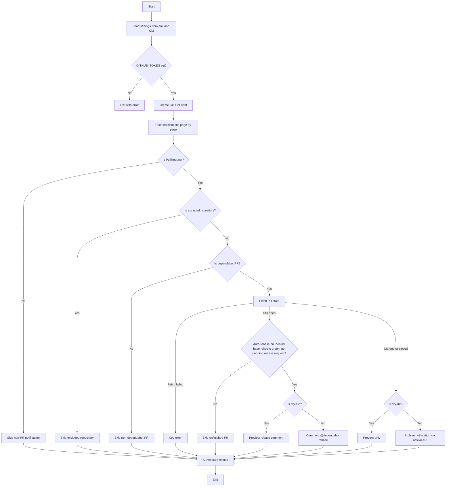

# GitHub Notification Auto Done

[](https://github.com/xenoamess/github-notification-auto-done-skill/actions/workflows/ci.yml)
[](https://www.python.org/downloads/)
[](https://github.com/psf/black)

A small Python tool that automatically archives GitHub notifications for **merged or closed dependabot Pull Requests**, so your inbox stays clean without manual clicks.

Optionally, it can also comment `@dependabot rebase` on **open** dependabot PRs that are out-of-date with the base branch while all checks have passed, so auto-merge can proceed without manual clicks either.

---

## What it does

If you maintain projects that receive a lot of dependabot PRs, your GitHub notification inbox probably looks like this:

- hundreds of "Bump xxx from A to B" notifications
- many of them are already merged or closed
- you still have to open/archiving them one by one

This tool connects to the GitHub REST API, finds those stale dependabot PR notifications, and marks them as **Done** (the same as clicking the archive/done button on [github.com/notifications](https://github.com/notifications)).

```text
2024-07-01 09:00:00 INFO Starting GitHub notification cleanup
2024-07-01 09:00:01 INFO Fetched 42 notification(s)
2024-07-01 09:00:02 INFO Archived [merged]: Bump requests from 2.30.0 to 2.31.0
2024-07-01 09:00:02 INFO Done. archived=38 skipped=4 errors=0 total=42
```

---

## How it works



The archive step uses the **official** GitHub REST API endpoint:

```http
DELETE /notifications/threads/{thread_id}
```

This endpoint is documented as **"Mark a thread as done"** and is exactly what GitHub's own web UI does when you archive a notification.

---

## Auto-rebase open dependabot PRs

With `--auto-rebase` enabled, open dependabot PRs are **not** just skipped.
For each open dependabot PR the tool checks **all** of the following:

1. the branch is **out-of-date with the base branch** (`mergeable_state` is `behind`)
2. **all checks have passed** on the head commit (check runs succeeded /
   skipped / neutral, and the combined commit status is green)
3. dependabot is **not currently rebasing** — detected as: no
   `@dependabot rebase` comment was posted within the cooldown window
   (`--rebase-cooldown-minutes`, default 30)

When all three hold, the tool posts a `@dependabot rebase` comment on the PR.
Dependabot then rebases the branch, checks re-run, and any enabled auto-merge
can proceed.

```bash
# Preview which PRs would get a rebase comment
python -m github_notification_auto_done --auto-rebase --dry-run

# Actually comment
python -m github_notification_auto_done --auto-rebase
```

The same notification pass still archives merged/closed PRs, so one cron job
handles both duties.

---

## Installation

Requires **Python 3.8+**.

```bash
# Clone the repository
git clone https://github.com/xenoamess/github-notification-auto-done-skill.git
cd github-notification-auto-done-skill

# Create and activate a virtual environment (recommended)
python3 -m venv .venv
source .venv/bin/activate  # On Windows: .venv\Scripts\activate

# Install the package
pip install -e .
```

For development (linting, type checking, tests):

```bash
pip install -e ".[dev]"
```

---

## Configuration

Create a `.env` file from the example and add your token:

```bash
cp .env.example .env
# edit .env
```

`.env`:

```bash
GITHUB_TOKEN=ghp_xxxxxxxxxxxx
```

### Token permissions

- **Classic PAT**: needs the `notifications` and `repo` scopes.
- **Fine-grained PAT**: needs read access to notifications and repository contents/pull requests. With `--auto-rebase`, it additionally needs **Issues: write** (PR comments use the issues API) on the target repositories.

> Keep your token secret. Never commit `.env`.

---

## Usage

### Dry run (recommended first time)

```bash
python -m github_notification_auto_done --dry-run
```

This prints what would be archived without making any changes.

### Run for real

```bash
python -m github_notification_auto_done
```

### Run via the legacy script path

```bash
python scripts/github_notification_auto_done.py
```

### Cron (hourly)

```cron
0 * * * * cd /path/to/repo && /path/to/repo/.venv/bin/python -m github_notification_auto_done >> /var/log/github_cleanup.log 2>&1
```

---

## CLI options

| Option | Default | Description |
|--------|---------|-------------|
| `--dry-run` | `false` | Preview mode, no archive requests |
| `--since` | 24 hours ago | Only process notifications updated after this ISO 8601 timestamp |
| `--max-workers` | `4` | Concurrent API workers |
| `--exclude-repo` | none | Comma-separated list of `owner/repo` to ignore |
| `--log-file` | none | Also write logs to this file |
| `--json-logs` | `false` | Emit logs as newline-delimited JSON |
| `-v`, `--verbose` | `false` | Enable DEBUG logging |
| `--config` | none | Load defaults from a JSON or TOML file |
| `--auto-rebase` | `false` | Comment `@dependabot rebase` on open dependabot PRs that are behind the base branch with all checks green |
| `--rebase-cooldown-minutes` | `30` | Minimum minutes between two rebase requests for the same PR |

Environment variables with the same names (e.g. `MAX_WORKERS`, `EXCLUDE_REPOS`, `AUTO_REBASE`, `REBASE_COOLDOWN_MINUTES`) are also supported. CLI flags take precedence over environment variables, which take precedence over config files.

---

## Why not the old `/notifications/beta/archive` endpoint?

That URL is an internal beta endpoint used by GitHub's web frontend. It requires session-style authentication and is not officially supported for scripts or PATs. We use the documented `DELETE /notifications/threads/{thread_id}` endpoint instead, which is stable and officially supported.

---

## Development

```bash
# Lint
ruff check src tests scripts

# Format
black src tests scripts

# Type check
mypy src

# Run tests with coverage
pytest
```

---

## License

MIT
